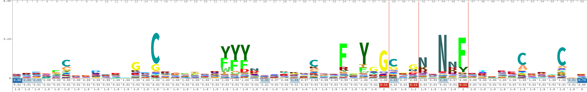

--------------------------------------------------------------------------------
# HMM-based Kunitz Domain Detector

## 🧬 Overview
This repository contains a complete bioinformatics pipeline for identifying the Kunitz-type protease inhibitor domain (PF00014) from protein sequences using a Hidden Markov Model (HMM).

## 🛠️ Tools & Pipeline
The model was built and evaluated using a robust combination of computational biology tools:
*   **CD-HIT:** Utilized to cluster and filter highly similar sequences, ensuring a high-quality, non-redundant training dataset.
*   **PDBeFold & MUSCLE:** Applied for 3D structural comparisons and Multiple Sequence Alignments (MSA) of the representative proteins to accurately identify conserved structural patterns.
*   **HMMER (hmmbuild & hmmsearch):** Used to construct the statistical HMM profile from the aligned sequences and to scan large-scale databases (UniProt/Swiss-Prot) for significant matches.

## 📊 Evaluation & Results
The model was rigorously evaluated on independent positive and negative test sets extracted from Swiss-Prot. By systematically testing various E-value thresholds via a custom Python script (`performance.py`), the model achieved its optimal classification performance at an E-value threshold of `1e-6`.

**Key Performance Metrics:**
*   **Accuracy (Q2 Score):** ~ 0.999 
*   **True Positive Rate (TPR):** ~ 1.0
*   **Positive Predictive Value (PPV):** ~ 1.0

## 🔍 HMM Logo & Motif Discovery

*(Note: Add your image to the repository and replace this text and the link below with the actual image link)*

**Interpretation:** 
The HMM logo visualizes the specific sequence patterns the model learned from the training data. For instance, the amino acid **Cysteine (C)** at **position 15** is highly conserved (appearing very tall in the logo). This demonstrates that the model successfully learned its critical importance as a key feature for recognizing true Kunitz domains.

--------------------------------------------------------------------------------
